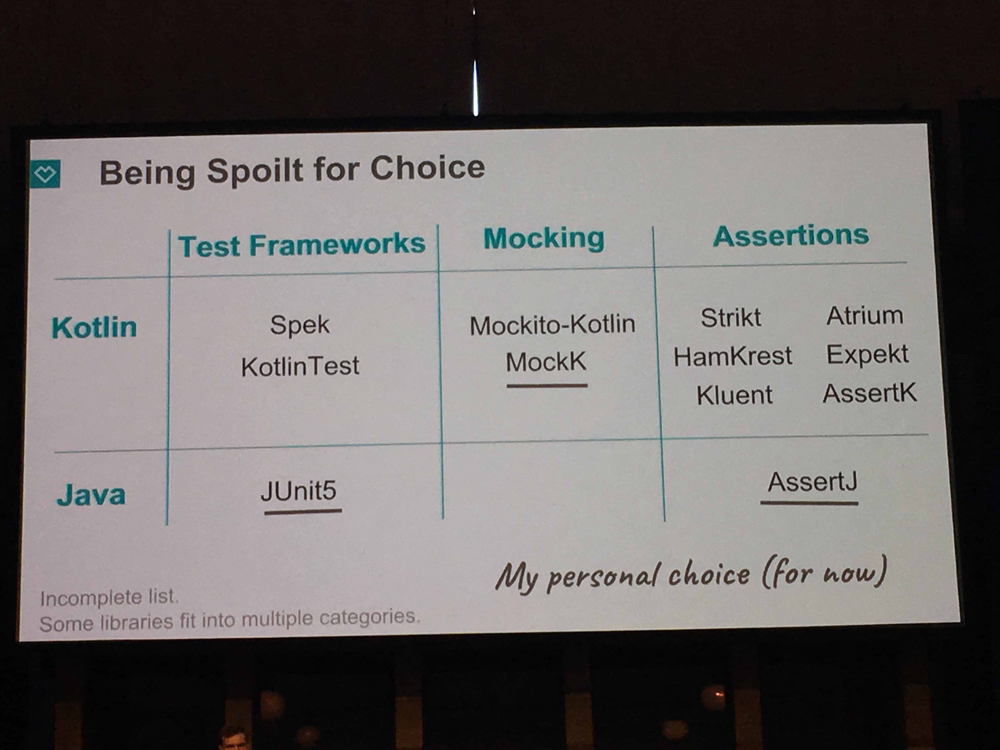
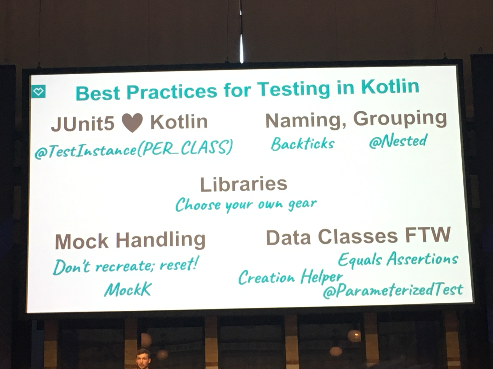

= Kotlin Conf
:toc:

== DSL in Kotlin

https://kotlinconf.com/schedule/#session=40652

https://gitlab.com/asarazan/kotlinconf18

[quote]
When you really wish your language could do the thing

=== Ktor

image::http://ktor.io/what-is-ktor-shadow.png[]

=== Advices
[quote]
Start from the result that you want to enable +
... then write the code thant enables it !

`@DslMarker` : prevent scoping mishaps !

* Dont' pollute the global namespace
* Unary `+` only if well-scoped
* Keep lambda files next to your builder classes
* Don't extend system types (String, Int, ...)

[source, kotlin]
----
42 { //bad
.....
}

100.dollarsToCent() // Good
----

== Kotlin and Spring Boot, a match made in heaven

https://kotlinconf.com/schedule/#session=41106

@nicolas_frankel

🤯 The issue : MAGIC !

🧐 The solution ? : functional configuration

Switch to reactive :

* JPA -> Mongo Reactive
* WebMVC -> WebFlux

Swith to static configuration (no magic) :

* RestController -> static route definitions -> Router definition DSL
* @Beans -> Bean Definition DSL
* `context.initializer.classes` property -> programmtically register BeansInitializer

=== SpringFu

https://spring.io/blog/2018/10/02/the-evolution-of-spring-fu

WARNING: Experimental 😜

https://github.com/ajavageek/springfunctional-migration

.kofu (no more annotations !)
[source, kotlin]
----
val beans = beans {
    bean<PersonHandler>()
    bean<PersonRepository>()
}

val app = application {
    import(beans)
    listener<ApplicationReadyEvent> {
        ref<PersonRepository>().insert(
                arrayListOf(Person(1, "John", "Doe", LocalDate.of(1970, 1, 1)),
                        Person(2, "Jane", "Doe", LocalDate.of(1970, 1, 1)),
                        Person(3, "Brian", "Goetz"))
        ).blockLast(Duration.ofSeconds(2))
    }
    server {
        import(::routes)
        codecs {
            jackson()
        }
    }
    mongodb {
        embedded()
    }
}

fun routes(handler: PersonHandler) = router {
    "/person".nest {
        GET("/{id}", handler::readOne)
        GET("/", handler::readAll)
    }
}

class PersonHandler(private val personRepository: PersonRepository) {
    fun readAll(request: ServerRequest) = ServerResponse.ok().body(personRepository.findAll())
    fun readOne(request: ServerRequest) = ServerResponse.ok().body(personRepository.findById(request.pathVariable("id").toLong()))
}

fun main(args: Array<String>) {
    app.run(args)
}

@Document
class Person(@Id val id: Long, val firstName: String, val lastName: String, val birthdate: LocalDate? = null)

class PersonRepository(private val mongo: ReactiveMongoOperations) {
    fun findAll() = mongo.findAll<Person>()
    fun findById(id: Long) = mongo.findById<Person>(id)
    fun insert(persons: List<Person>) = mongo.insert(persons, Person::class)
}
----

== GraphQL powered by Kotlin

https://kotlinconf.com/schedule/#date=4-october&session=22460

=== GraphQL server 

https://github.com/pgutkowski/KGraphQL

.GraphQL Type
[source]
----
type UFOSighting {
    id : Int!
    city: String
}
----

.KGraphQL
[source]
----
type <UFOSighting>

data class UFOSighting {
    id : Int = -1
    city: String?
}
----

=== GraphQL client

https://github.com/apollographql/apollo-android

Generate Java Client from `schema.json`

1. Build your request
2. Enqueue the resquest
3. Handle the response

[TIP]
==== 
* Intellij GraphQL plugin
* Retrofit GraphQL
====

image::https://raw.githubusercontent.com/sogko/graphql-shorthand-notation-cheat-sheet/master/graphql-shorthand-notation-cheat-sheet.png[]

== Architecting a Kotlin JVM and JS multiplatform project

https://kotlinconf.com/schedule/#date=4-october&session=41120

[quote]
Ideal for businnes logic code sharing

[quote]
Kotlin Multiplatform != React Native

[quote]
Kotlin Multiplatform > C / C++

Common 

-> kotlinc (JVM, Android)

-> Kotlin/Native (Executable, Dynamic lib, iOS)

-> kotlin2js (Javascript)

=== Gradle plugins 

* `apply plugin: 'kotlin-platform-common'`
* `apply plugin: 'kotlin-platform-jvm'`
* `apply plugin: 'org.jetbrains.kotlin.frontend`
* ...

=== Concept

.Common
[source, kotlin]
----
expect class Order {
    val id: Int
    val userId: Int
}
----

.JVM
[source, kotlin]
----
actual data class Order {
    val id: Int
    val userId: Int
}
----

`expect` is not interface !

* simplier implementation
* can have a constructor
* all implementations are known at compile time
* more flexibility
* top level and extension functions are supported

[WARNING]
====
* Cannot reference any platform specific code
* Can only have kotlin code
* Can depend only platform common lib
====

https://github.com/felipecsl/ktnes

== Exploring the Kotlin type hierarchy from top to bottom

https://kotlinconf.com/schedule/#date=4-october&session=33626

Slides : https://speakerdeck.com/npryce/the-kotlin-type-hierarchy-from-top-to-bottom

👍👍👍👍👍👍

== New Type Inference and Related Language Features

https://kotlinconf.com/schedule/#date=4-october&session=45353

TIP: you need to explicity opt in at the call site to use experimental features : `kotlin { experimental { contracts 'enable'}`

[TIP]
=====
you can mark your experimental API with :

[source]
----
@Experimental
annotation class ShinyNewAPI

@ShinyNewAPI
class Foo
----
=====

=== Contracts

[quote]
We know something about run, which the compiler doesn't

*Contracts allow to share extra information about code semantics with the compiler*

* Making smart casts even smarter

[source]
----
fun String?.isNullOrEmpty(): Boolean {
    contract {
        returns(false) implies (this@isNullOrEmpty != null)
    }
    return this == "" || this == null
}

val s: String? = ""
if (!s.isNullOrEmpty) {
    s.first() // ✅
}
----

=== New type inference

* Better and more powerful type inference
* New Features are supported

`kotlin { experimental { newInference 'enable'}`

TIP: Libraries should specify return types for public API : turn on the IDE inspection ("Public API delcaration has implicit return type")

* _Function Interface_ conversions for Kotlin functions
* better inference for builders
* better inference for call chains
* better inference for intersection types

== Representing State: the Kotlin Edition

https://kotlinconf.com/schedule/#date=4-october&session=44706

https://twitter.com/runchristinarun

👻 Boolean Blindness => work with more expressive types !

* use `sealed` classes (everywhere !)
* use `interfaces` for boolean representation

💥 Strings are *danger* (same for Int) => infinite input 😱

.Limit state !
[source, kotlin]
----
class IllogicalPerson {
    var heart: Heart?
    var head: Head?
    var arms: List<Arm>
    var legs: List<Leg>
}

class LogicalPerson {
    var heart: Heart
    val head: Head
    val arms: Pair<Arm?,Arm?>
    val legs: Pair<Leg?,Leg?>
}
----

😻😻😻😻

== Exploring Coroutines in Kotlin

https://kotlinconf.com/schedule/#date=4-october&session=41601

Code : https://agiledeveloper.com/presentations/exploring_coroutines_in_kotlin.zip

.Parallel Stream
[quote]
Structure of [functional] sequential code is the same as parallel code

.Coroutine
[quote]
Structure of [imperative] synchronous code is the same as asynchronous code

🤩😎🤩😎🤩😎🤩😎🤩😎🤩😎

== Functional Programming in Kotlin with Λrrow

https://kotlinconf.com/schedule/#date=4-october&session=21819

image:https://arrow-kt.io/img/arrow-brand-sidebar.svg[float=left]

https://arrow-kt.io/

=== Immutable model 

* with data class for simple case
* Arrow provides `optics` with `lens` (https://arrow-kt.io/docs/optics/dsl/#optics-dsl)

=== Pure

* Don't throw exceptions -> use `Either` and `Try` but it's *synchronous*
* Arrow provides _Monad Transformers_ : `EitherT`

=== Async non-blocking

* Higher kinded types : abstract away the computational container type
** `class Option<A> : OptionOf<A>
** https://arrow-kt.io/docs/typeclasses/monad/#kindf-aflatmap` 

=== KEEP-87

MR to add Type Class in Kotlin :
https://github.com/Kotlin/KEEP/pull/87

.Type class declaration
[source]
----
interface Repository<A> {
    fun A.save(): A
    fun cache(): List<A>
}
----

== Building Server Backends with Ktor

https://kotlinconf.com/schedule/#date=4-october&session=41725

https://ktor.io/

[quote]
Composable, DSL based web services in Kotlin

WARNING: 1.0 waiting for Kotlin 1.3 (corountine no more experimental)

.ktor
[source, kotlin]
----
fun Application.verify() {
    install(StatusPages) {...}
    install(ContentNegociation) {...}
    routing {
        post("/verify") {
            call.respond(Response(status="OK")
        }
    }
}

data class Response(val status: String)
----

== Best Practices for Unit Testing in Kotlin

https://kotlinconf.com/schedule/#date=4-october&session=41109

=== Junit 5

* Reuse the Test Class Instance :
`@TestInstance(TestInstance.Lifecycle.PER_CLASS)` +
-> you can use `private val` field or `init {...}` block

TIP : you can set the lifecycle by defaut in `junit-platform.properties file` (no more need annotation)

* Use backticks for test name

* Use `@Nested` to group tests (by tested method of class for instance)

=== Kotlin Test Libraries

TIP : write test specific extension for AssertJ

=== Mocking

WARNING: ☠️ Classes Are Final by Default 

=> use `MockK` (https://mockk.io/)

* Don't recreate Mocks ! (it's expensive : 2,1s -> 0,4s )

[source]
----
@BeforeEach
fun init() {
    clearMocks(repo, client)
}
----

=== Spring Integration

* Use maven plugin `allopen` to deal with final classes (✅)
* Use constructor injection (👍)

=== Data class

* Use for Assertions !

TIP: `assertThat(...).isEqualToIgnoringGivendFields(..., "id")`

* Helper function for Object Creation (use default values for data class args)

* Data classes for Parameterized Test with `@MethodSource` 

=== Summary

== Creating Internal DSLs in Kotlin

https://kotlinconf.com/schedule/#date=4-october&session=41599

